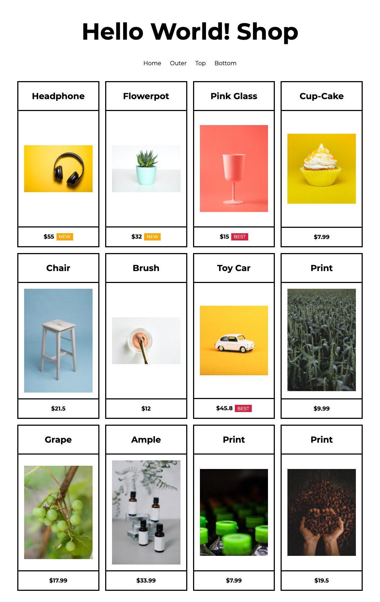
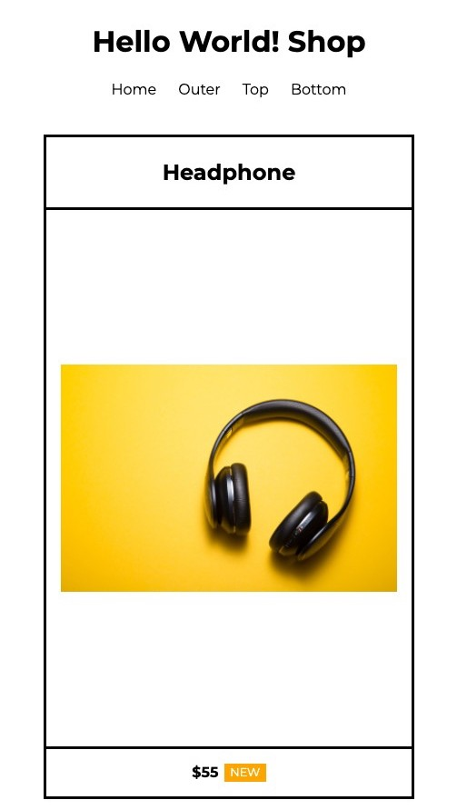

# 도서 CSS3 독학백서 실전 예제

도서 CSS3 독학백서 Chapter 07. 실전 예제 따라하기 실습 코드입니다. (플렉스 박스와 그리드를 사용한 반응형 레이아웃 쇼핑몰 만들기) HTML & CSS 입문자에게 적합한 난이도이며 HTML, CSS만으로 작성되었습니다.

-   [Demo 사이트 보기](https://dalmoori.github.io/final-css3-2021/)
-   [CSS3 독학백서 전체 코드 보기](https://github.com/dalmoori/basic-css3-2021)

## eBook (전자책) 구매 링크

-   [교보문고](http://digital.kyobobook.co.kr/digital/ebook/ebookDetail.ink?selectedLargeCategory=001&barcode=480D210330180&orderClick=LAG&Kc=)
-   [알라딘](https://www.aladin.co.kr/shop/wproduct.aspx?ItemId=268128304)
-   [YES24](http://www.yes24.com/Product/Goods/98828987?OzSrank=1)
-   [Google Play](https://play.google.com/store/books/details/%ED%95%B4%EB%8B%AC%EB%B3%84_CSS3_%EB%8F%85%ED%95%99%EB%B0%B1%EC%84%9C?id=_UwlEAAAQBAJ)

## 미리보기

## 사용된 폰트

-   [Montserrat](https://fonts.google.com/specimen/Montserrat?preview.text_type=custom)

## 사용된 이미지 출처

-   @cdx2 https://unsplash.com/photos/PDX_a_82obo
-   @ruslanbardash https://unsplash.com/photos/4kTbAMRAHtQ
-   @galina88 https://unsplash.com/photos/miziNqvJx5M
-   @giorgiotrovato https://unsplash.com/photos/p0OlRAAYXLY
-   @picoftasty https://unsplash.com/photos/GnWKTJlMYsQ
-   @matosallbers https://unsplash.com/photos/Ltv7a5m8i4c
-   @priscilladupreez https://unsplash.com/photos/ePPcMfzYQ-Y
-   @joannakosinska https://unsplash.com/photos/mVdzV_HTyH4
-   @pablomerchanm https://unsplash.com/photos/SCbq6uKCyMY
-   @jonnysplsh https://unsplash.com/photos/Ox4krGBQn2U
-   @shyshkina https://unsplash.com/photos/2rFO8W5SkBk
-   @eduschadesoares https://unsplash.com/photos/byfmNM4ssRA
